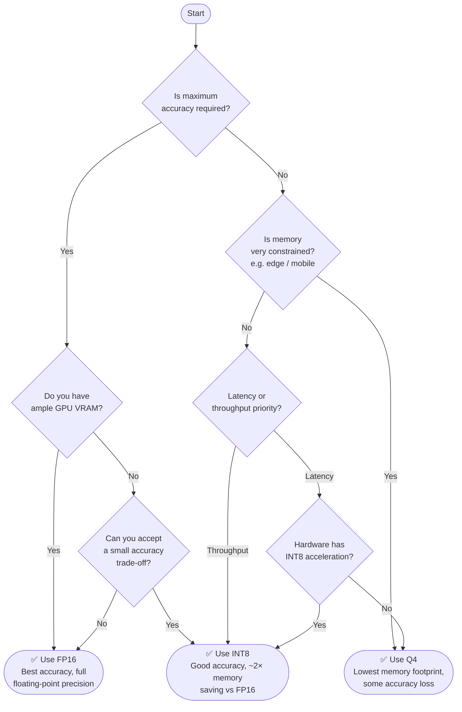

# Quantization Format Decision Tree: FP16 vs INT8 vs Q4

Use this decision tree to choose the right quantization format for your model.

## Quick Reference

| Format | Bits | Relative Memory | Accuracy | Best For |
|--------|------|-----------------|----------|----------|
| **FP16** | 16 | ~2× INT8 | Highest | Training, high-accuracy inference |
| **INT8** | 8 | ~2× Q4 | High | Server inference, throughput workloads |
| **Q4**  | 4  | Lowest | Moderate | Edge devices, memory-constrained environments |

## When to Choose Each Format

### FP16 — 16-bit Floating Point
- You need the **highest possible accuracy**
- Running on a GPU with plenty of VRAM
- Fine-tuning or continued training
- Serving a model where quality is non-negotiable

### INT8 — 8-bit Integer Quantization
- You want a **good balance** of accuracy and efficiency
- Your hardware supports INT8 acceleration (most modern GPUs/CPUs do)
- Serving large models at scale where throughput matters
- ~2× memory reduction with minimal accuracy loss

### Q4 — 4-bit Quantization
- Memory is **severely constrained** (e.g., consumer GPUs, mobile, edge)
- Running large language models locally (e.g., llama.cpp, GGUF format)
- Accuracy trade-off is acceptable for your use case
- ~4× memory reduction vs FP16
